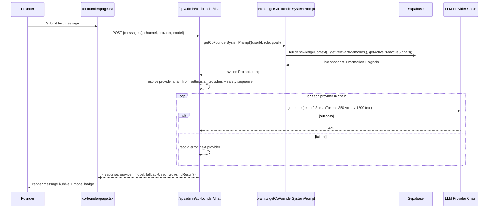
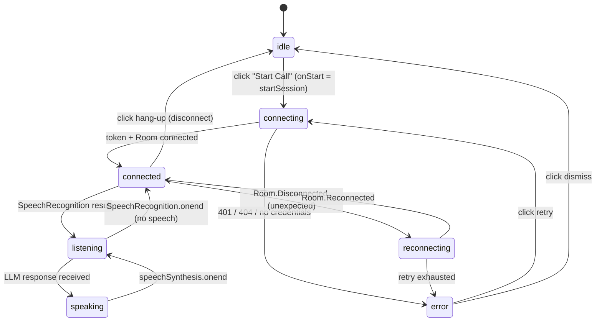
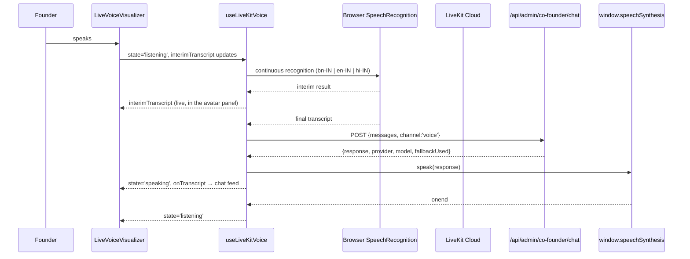
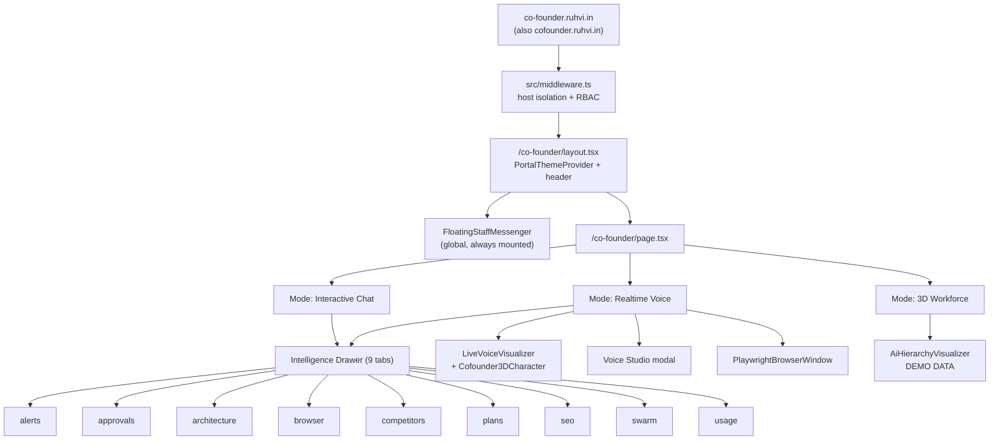
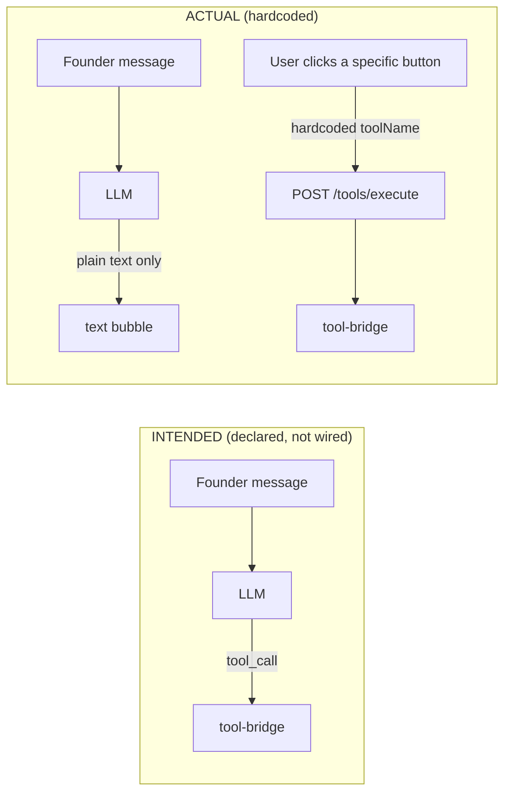
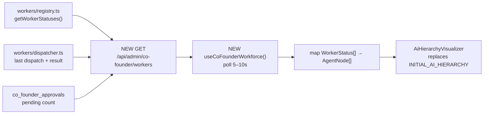

# AI CO-FOUNDER — UI/UX REDESIGN DISCOVERY DOCUMENT

**Purpose:** Specification input for a future, non-destructive UI/UX redesign of the Ruhvi AI Co-Founder.
**Nature:** Discovery & documentation only. No code was modified to produce this document.
**Repository root:** `C:\Users\INDIA\Desktop\Project Ruhvi`
**Date of inspection:** 2026-10-04

---

## 0. HOW TO READ THIS DOCUMENT

### 0.1 Implementation status legend (used throughout)

| Label | Meaning |
|---|---|
| **[IMPLEMENTED]** | Verified by reading the source file(s) cited. The code path exists. |
| **[PARTIAL]** | Code exists and runs, but is incomplete, hardcoded, or narrower than documentation implies. |
| **[PLACEHOLDER / DEMO]** | UI exists but is driven by static/hardcoded mock data, not by live backend data. |
| **[PLANNED]** | Mentioned in docs or comments only. No implementing code found. |
| **[ORPHANED]** | Component file exists but is imported nowhere. |
| **[NOT VERIFIED]** | Could not be confirmed from the repository (runtime-only, env-dependent, or external). |
| **[BROKEN — verified]** | The code path exists and is reachable from the UI, but provably cannot succeed. The failure is **silent** (no user-visible error). §14.3. |
| **[Absent]** | No implementing code found, and none is claimed to exist elsewhere. |
| **[IMPLEMENTED BUT UNPROTECTED]** | Works, but is missing an authorization guard that its sibling routes have. §14.2. |

### 0.1b Secondary labels used for emphasis

`**Silent**` = the operation fails with no user-visible feedback. `**Corrected**` = the secondary document's claim is wrong and this document gives the accurate value. `[NOT VERIFIED — runtime only]` = could not be checked without running the app.

### 0.2 A note on the requested source document `ai_co-founder.md`

The task referenced an existing `ai_co-founder.md`. **That file does not exist anywhere in this repository** (verified via recursive search). Two closely related documents do exist and were used as *secondary* evidence only:

- `AI_COFOUNDER_EXECUTION_CHECKLIST.md` — stage/phase completion checklist (Stages 1–10).
- `RUHVI_AI_COFOUNDER_MASTER_REPORT.md` — consolidated report claiming "100% Implemented, Verified & Production-Ready."

> **Critical caveat for the redesign agent:** Where this document and `RUHVI_AI_COFOUNDER_MASTER_REPORT.md` disagree, **this document wins**, because it was written from the actual source code. Several concrete divergences are called out in §1.3 and §22.

### 0.3 Rules for the future redesign agent

1. Treat §18 (**DO NOT BREAK**) as binding.
2. Treat §19 (Safe Redesign Boundaries) as the authority on what may be touched.
3. Never assume a feature exists because a report claims it. Check the status label.
4. Preserve every element `id` and `htmlFor` pair listed in §18.3, and every `localStorage` key in §18.2. These are the only verified cross-cutting DOM/storage contracts in the Co-Founder UI.
5. Note there is **no Playwright E2E suite in this repository** (see §18.9). The visualizer is not currently protected by DOM-level tests, so DOM-hook regressions will not be caught by CI.

---

## 1. EXECUTIVE DISCOVERY SUMMARY

### 1.1 What the AI Co-Founder actually is

**[IMPLEMENTED]** A single-page executive portal at route `/co-founder` that combines:

1. A **text chat** interface backed by a multi-provider LLM router with automatic failover.
2. A **voice interface** built on LiveKit (WebRTC transport) **plus** browser-native `SpeechRecognition` (STT) and `speechSynthesis` (TTS).
3. A **3D workforce visualization** (Three.js) that is currently **entirely hardcoded demo data**.
4. A **widget drawer** with 9 tabs pulling live data from the Supabase-backed AI engine: proactive alerts, approvals, competitors, SEO audit, repo architecture, LiveKit usage, embedded Playwright browser results, action plans, and a nested swarm view.

**[IMPLEMENTED]** Behind the UI sits a genuinely substantial server-side AI engine: a "brain" prompt synthesizer, 12 specialized workers, a nested 6-co-worker marketing subsystem, an analytics/BI engine, a root-cause engine, a strategy engine, an action planner that writes into the real Task Manager, an approval state machine with server-side enforcement, an outcome/learning loop, and a Supabase long-term memory store.

### 1.2 The single most important architectural fact

**The 3D workforce layer and the real AI worker layer are completely disconnected.**

| Layer | Data source | Status |
|---|---|---|
| `src/components/ai/motion-engine/*` (what the user sees) | `nodes-data.ts` — a hardcoded `AgentNode[]` literal | **[PLACEHOLDER / DEMO]** |
| `src/lib/ai/co-founder/workers/*` (what actually runs) | Real Supabase queries via `getServiceClient()` | **[IMPLEMENTED]** |

There is **no API route, no fetch, no hook, and no shared state** that connects the 3D hierarchy to the live worker registry. Verified: `AiHierarchyVisualizer.tsx`, `WorkforceSwarm3D.tsx`, `LiveWorkingWorkspace.tsx`, `WorkerDisplayWindow.tsx`, and `GrokDots*.tsx` contain **zero** `fetch()` calls. All "telemetry" (latency, tokens/sec, compute load, log lines, progress %, autonomy level) shown in the 3D view is invented mock data in `nodes-data.ts`.

The only live signal bridged into the 3D layer today is `audioLevel` and `isThinking`, passed down from `LiveVoiceVisualizer` → `AiHierarchyVisualizer` → 3D components.

> **Implication for redesign:** the 3D workforce view can be restyled, restructured, or replaced with zero functional risk *today* — because it is decoration. But if the redesign wants to make it truthful (showing real worker state), that is a **new feature**, not a redesign, and requires a new data path.

### 1.3 Verified divergences from `RUHVI_AI_COFOUNDER_MASTER_REPORT.md`

| Master report claim | Verified reality |
|---|---|
| "Gemini 2.0 Flash Multimodal Live bridge" for voice | **[NOT VERIFIED / effectively unimplemented].** `useLiveKitVoice.ts` does STT via browser `SpeechRecognition` and TTS via browser `speechSynthesis`. Gemini is only used server-side for text chat. There is no Gemini Live WebSocket anywhere in the Co-Founder path. |
| "Barge-In (VAD) immediately yields playback" | **[PARTIAL].** Barge-in is implemented via `window.speechSynthesis.cancel()` on detected interim speech — not VAD, not a server turn-detection model. See §9.5. |
| "SHA-256 fingerprinting prevents duplicate alerts" | **[PARTIAL].** `proactive.ts` uses a plain deterministic **string** fingerprint (`${type}:${entityId}:${dateBucket}`), not SHA-256. |
| "17 test suites / 268 tests passing" | **[NOT VERIFIED].** 30 Co-Founder/LiveKit test files exist. Test counts were not executed during this discovery task. |
| "4 additive migrations" | **[IMPLEMENTED but incomplete list].** There are **6** Co-Founder migrations (`0102`–`0106`, `0109`), not 4. |
| "Autonomous scanners continually evaluate…" via cron | **[PARTIAL].** `/api/cron/co-founder/proactive` exists and is functional, but it is **NOT registered in `vercel.json`** — `vercel.json` only lists `/api/cron/automations` and `/api/cron/publish-blog`. So the proactive scan does **not** appear to be running on a schedule. |
| Executive Voice Studio is "Beta" | **[PARTIAL].** Modal exists and works; all its copy is **Bengali**, including the "live sample" that also plays for English/Hindi users. |

---

## 2. CORE SYSTEM

### 2.1 Responsibilities **[IMPLEMENTED]**

Per `src/lib/ai/co-founder/brain.ts`, the system prompt assigns the AI these duties:
- Act as executive AI Co-Founder / strategic business partner for Ruhvi (fine jewellery, India).
- Think across Product, Catalog, Inventory, Marketing, Customer Care, Unit Economics, Technology.
- Adapt language/script dynamically (Bengali / Hindi / English / Banglish / Hinglish code-switching).
- Enforce a strict data-freshness contract: live DB > tool output > memory > model priors; never invent numbers.
- Enforce approval boundaries: reads auto-execute; high-impact writes require explicit founder approval.
- Follow a 9-step advisor protocol: context → BI scan → RCA → strategy → action plan → task execution → proactive mode → measure/learn → worker orchestration.
- Orchestrate 12 named workers.

### 2.2 Core capabilities matrix

| Capability | Tool name | Status | Primary source |
|---|---|---|---|
| Store metrics (revenue/orders/AOV/cancel) | `get_store_metrics`, `get_sales_analytics` | **[IMPLEMENTED]** | `analytics.ts` |
| Recent orders | `get_orders` | **[IMPLEMENTED]** | `tool-bridge.ts` |
| Inventory levels | `get_inventory_levels` | **[IMPLEMENTED]** | `tool-bridge.ts` |
| Support tickets | `get_support_tickets` | **[IMPLEMENTED]** | `tool-bridge.ts` |
| Proactive signals | `get_proactive_signals` | **[IMPLEMENTED]** | `proactive.ts` |
| Approvals list / decide | `get_pending_approvals`, `submit_approval_decision` | **[IMPLEMENTED]** | `approvals.ts` |
| Approved action execution | `execute_approved_action` | **[IMPLEMENTED]** | `action-engine.ts` |
| Repo architecture | `get_repository_architecture` | **[IMPLEMENTED]** | `engineering.ts` |
| Error inspection | `inspect_recent_errors` | **[IMPLEMENTED]** | `engineering.ts` |
| Code security review | `review_code_snippet` | **[IMPLEMENTED]** | `engineering.ts` |
| Outcome feedback / analytics | `record_outcome_feedback`, `get_outcome_analytics` | **[IMPLEMENTED]** | `outcomes.ts` |
| Website browsing | `browse_website` | **[IMPLEMENTED]** | `browser/playwright.ts` |
| 360° business context | `get_business_context` | **[IMPLEMENTED]** | `business-context.ts` |
| BI scan | `run_business_intelligence_scan` | **[IMPLEMENTED]** | `business-intelligence.ts` |
| Root-cause analysis | `investigate_root_cause` | **[IMPLEMENTED]** | `root-cause.ts` |
| Strategy formulation | `formulate_strategy` | **[IMPLEMENTED]** | `strategy-engine.ts` |
| Action plan generation | `generate_action_plan` | **[IMPLEMENTED]** | `action-planner.ts` |
| Action plan execution → Task Manager | `execute_action_plan` | **[IMPLEMENTED]** | `action-planner.ts` |
| Worker dispatch | `dispatch_worker_task` | **[IMPLEMENTED]** | `workers/dispatcher.ts` |
| Worker status register | `get_worker_statuses` | **[IMPLEMENTED]** | `workers/registry.ts` |
| SEO catalog audit | `audit_seo_health` | **[IMPLEMENTED]** | `seo-health.ts` |
| Competitors CRUD + analyze | `get_competitors`, `add_competitor` | **[IMPLEMENTED]** | `competitors.ts` |
| Marketing co-worker dispatch/status/toggle | `dispatch_marketing_coworker`, `get_marketing_coworker_statuses`, `toggle_marketing_coworker` | **[IMPLEMENTED]** | `workers/marketing/*` |
| Media job trigger / status | `trigger_media_processing_job`, `get_media_job_status` | **[PARTIAL]** | `marketing/media-job-service.ts` |
| Ad campaign publish | `publish_ad_campaign` | **[IMPLEMENTED]** (approval-gated draft) | `marketing/meta-ads-service.ts` |

### 2.3 Main user workflows (verified)

1. **Realtime voice conversation** — start call → mic capture → STT → `/api/admin/co-founder/chat` → LLM → TTS speak. Transcript mirrored into chat feed.
2. **Text chat** — type → `/api/admin/co-founder/chat` → LLM response with provider/model/fallback badge.
3. **Intelligence triage** — open Alerts tab → read proactive signals → Dismiss.
4. **Approval decision** — Approvals tab → Approve/Reject → state machine transition.
5. **Competitor research** — add competitor → Analyze Live → Playwright browse + `analyzeCompetitor` → insights stored & rendered.
6. **SEO audit** — Rescan SEO → `auditCatalogSeoHealth()` → health score + 3 defect counters.
7. **Action plan execution** — Plans tab → (handler `handleExecuteActionPlan` exists) → creates real tasks in Task Manager.
8. **3D workforce exploration** — Swarm tab → hover/select node → read simulated telemetry.

### 2.4 AI decision/response flow (verified, text channel)



**Note on tool-calling:** `CO_FOUNDER_TOOL_DECLARATIONS` is exported from `brain.ts` and returned by `/api/admin/co-founder/session`, but the `/chat` route **does not wire function-calling**. Tools are instead invoked by the UI calling `/api/admin/co-founder/tools/execute` explicitly. **[PARTIAL]** — the declaration surface exists; the model-driven tool loop is not connected in the chat route.

### 2.5 Verified end-to-end architecture

```mermaid
flowchart TD
  subgraph Client
    U[User]
    PAGE[co-founder/page.tsx]
    LV[LiveVoiceVisualizer]
    PW[PlaywrightBrowserWindow]
    AH[AiHierarchyVisualizer<br/>DEMO DATA]
    HOOK[useLiveKitVoice]
  end

  subgraph Edge
    MW[middleware.ts<br/>host + RBAC gate]
  end

  subgraph NextAPI
    CHAT[/api/admin/co-founder/chat]
    TOKEN[/api/admin/co-founder/token]
    TOOLS[/api/admin/co-founder/tools/execute]
    PLANS[/api/admin/co-founder/action-plans]
    COMPS[/api/admin/co-founder/competitors]
    SEO[/api/admin/co-founder/seo-audit]
    MODELS[/api/admin/co-founder/models]
    USAGE[/api/admin/co-founder/livekit-usage]
    BROWSE[/api/admin/co-founder/browse]
    SESS[/api/admin/co-founder/session]
    DISP[/api/admin/co-founder/agent/dispatch]
    CRON[/api/cron/co-founder/proactive]
  end

  subgraph AIEngine
    BRAIN[brain.ts]
    TB[tool-bridge.ts]
    DISPATCH[workers/dispatcher.ts]
    REG[workers/registry.ts]
    MKT[workers/marketing/*]
  end

  subgraph Data
    SB[(Supabase<br/>co_founder_* + business tables)]
  end

  subgraph External
    LK[LiveKit Cloud]
    LLM[Gemini / DeepSeek /<br/>Custom / OpenAI / Anthropic]
    PWT[Playwright]
  end

  U --> MW --> PAGE
  PAGE --> LV --> AH
  PAGE --> PW
  PAGE <--> HOOK
  HOOK -->|WebRTC| LK
  HOOK -->|token| TOKEN
  HOOK -->|STT text| CHAT
  PAGE -->|text| CHAT
  PAGE -->|tool calls| TOOLS
  PAGE --> PLANS
  PAGE --> COMPS
  PAGE --> SEO
  PAGE --> MODELS
  PAGE --> USAGE
  PAGE --> BROWSE
  HOOK -.background.-> DISP
  CHAT --> BRAIN
  CHAT --> LLM
  TOOLS --> TB
  TB --> DISPATCH
  DISPATCH --> REG
  DISPATCH --> MKT
  TB --> SB
  BRAIN --> SB
  CRON --> SB
  BROWSE --> PWT
```

---

## 3. ARCHITECTURE — WORKERS, TASKS, TOOLS

### 3.1 Agent/worker architecture **[IMPLEMENTED]**

- Contract: `workers/types.ts` → `AIWorkerInterface` with `getDefinition()` and `execute(input)`.
- Registration: `workers/registry.ts` → `WorkerRegistry` class, singleton `workerRegistry`, registers all 12 workers in the constructor.
- Routing: `registry.findWorkerForTask(taskText)` — ordered `if/else` keyword matcher. **Not** semantic/embedding-based.
- Dispatch: `workers/dispatcher.ts` → `dispatchWorkerTask(workerIdOrQuery, input)`.
- Export barrel: `workers/index.ts`.

### 3.2 Task execution architecture **[IMPLEMENTED]**

The Co-Founder does **not** use its own task table. It writes into the shared Task Manager:

`action-planner.ts: executeActionPlanToTaskManager(planId, staffUserId)`
→ resolves `task_priorities`, `task_statuses`, `departments` by lowercased name
→ inserts into `tasks` with generated `task_id_text` like `TM-AI-<base36>-<rand>`
→ inserts `task_checklists` rows
→ inserts `task_activity` row
→ registers `co_founder_outcomes` trackers
→ flips `co_founder_action_plans.status` to `in_progress`.

### 3.3 Tool execution architecture **[IMPLEMENTED]**

`tool-bridge.ts: executeCoFounderTool(toolName, args, userScopes)`:
1. `assertToolPermission(userScopes, toolName)` against `TOOL_PERMISSION_MAP` in `mcp-auth.ts` — **fails closed** for unmapped tools.
2. Giant `switch (toolName)` with 33 cases.
3. Each case returns `{toolName, success, data, error?, summaryForVoice}`.

The UI reaches this only via `POST /api/admin/co-founder/tools/execute`, which **hardcodes a read-only scope list** (22 `*:read` scopes) and passes it in. Consequence: **from the Co-Founder page, no write-scoped tool can succeed.** This is why the Approvals tab's Approve/Reject works (`submit_approval_decision` is mapped to `analytics:write`… which is *not* in the hardcoded list) — see §18.4 for this verified defect.

---

## 4. ALL UI SCREENS AND ROUTES

### 4.1 Route inventory

| # | Screen | Route | Source file | Auth |
|---|---|---|---|---|
| 1 | AI Co-Founder Executive Command Center | `/co-founder` | `src/app/co-founder/page.tsx` (77 KB, ~1790 lines) | `requireAdmin` via API; middleware host gate |
| 2 | Co-Founder portal chrome | `/co-founder` (layout) | `src/app/co-founder/layout.tsx` | `useAuth()` |
| 3 | Executive Voice Studio modal | overlay on `/co-founder` | inline in `page.tsx` (~L1590–1790) | inherits |
| 4 | Playwright Browser Window (expanded) | overlay/drawer on `/co-founder` | `src/components/co-founder/PlaywrightBrowserWindow.tsx` | inherits |
| 5 | Playwright Browser Window (minimized pill) | fixed bottom-right | same | inherits |
| 6 | 3D Workforce (Swarm tab) | inline tab on `/co-founder` | `AiHierarchyVisualizer.tsx` | inherits |
| 7 | Intelligence Drawer (9 widget tabs) | right column of `/co-founder` | `src/app/co-founder/page.tsx` (~L912–1590) | inherits |
| 8 | Legacy / alternate Co-Founder chat | `/admin/ai-chat` | `src/app/admin/ai-chat/page.tsx` | `requireAdmin` via `/api/chat` |

> **Note on row 8:** `/admin/ai-chat` is a **second, separate Co-Founder surface**. It reuses the same `LiveVoiceVisualizer` and `useLiveKitVoice` hook, but posts text to `/api/chat` — **not** `/api/admin/co-founder/chat` — and therefore bypasses the Co-Founder brain, the multi-provider fallback chain, and every Co-Founder tool. It is reachable from the Co-Founder host because `src/middleware.ts:142` explicitly allows `/admin/ai-chat` there.

### 4.2 API route inventory

All Co-Founder routes live under `src/app/api/admin/co-founder/`. Every route is reachable from **any** host, because `src/middleware.ts:95` lists `/api` in `commonAllowedPaths` and therefore exempts the entire API surface from subdomain isolation. The only protection is per-route auth.

| Route | Method(s) | Auth guard | Engine reached | Status |
|---|---|---|---|---|
| `chat/route.ts` | POST | `requireAdmin` | `brain.ts` → LLM chain | **[IMPLEMENTED]** |
| `token/route.ts` | POST | `requireAdmin` | `lib/livekit/token.ts` | **[IMPLEMENTED]** |
| `tools/execute/route.ts` | POST | `requireAdmin` | `tool-bridge.ts` (33 cases) | **[PARTIAL]** — read-only scopes hardcoded, see §17.3 |
| `action-plans/route.ts` | GET, POST | **none** | `action-planner.ts`, `strategy-engine.ts` | **[IMPLEMENTED]** but **unauthenticated**, see §14.2 |
| `competitors/route.ts` | GET, POST, DELETE | `requireAdmin` | `competitors.ts` | **[IMPLEMENTED]** |
| `seo-audit/route.ts` | GET | `requireAdmin` | `seo-health.ts` | **[IMPLEMENTED]** |
| `browse/route.ts` | POST | `requireAdmin` | `browser/playwright.ts` | **[IMPLEMENTED]** |
| `models/route.ts` | GET | `requireAdmin` | `settings.ai_providers` | **[IMPLEMENTED]** |
| `livekit-usage/route.ts` | GET | `requireAdmin` | LiveKit Cloud REST | **[IMPLEMENTED]** |
| `session/route.ts` | GET | `requireAdmin` | `brain.ts` tool declarations | **[IMPLEMENTED]** (declarations only) |
| `agent/dispatch/route.ts` | POST | `requireAdmin` | `workers/dispatcher.ts` | **[IMPLEMENTED]** |
| `../../cron/co-founder/proactive/route.ts` | GET | cron secret | `proactive.ts` | **[PARTIAL]** — not in `vercel.json` schedule |

### 4.3 Screen detail

#### 4.3.1 `/co-founder` — Executive Command Center **[IMPLEMENTED]**

- **File:** `src/app/co-founder/page.tsx`, 1837 lines, `'use client'`.
- **Shell:** `mx-auto flex h-[calc(100vh-4rem)] max-w-7xl flex-col space-y-4 p-4 md:p-6`. Fixed viewport-height layout, no page-level scroll.
- **State:** 26 `useState` hooks, all local. **No React Query / SWR / server cache anywhere in this file.**
- **Three top-level modes** (`activeTab`, default `'voice'`):
  - `voice` — 7/12 column split: 3D voice avatar | intelligence drawer + chat stream
  - `chat` — 5/12 column split: 3D voice avatar dimmed to `opacity-80` | full-width chat
  - `swarm_3d` — full-width `AiHierarchyVisualizer`, chat and drawer are **not rendered**
- **Header block:** brand tile, title, "Executive Command Center" pill, LiveKit free-tier minutes chip (clickable → jumps to Usage tab), then a control cluster: Provider select, Model select, Language select, Voice Studio button, then the 3-way mode switcher.
- **Fallback chain banner:** renders only when `fallbackChain.length > 0`, shows the ordered provider chain with the selected provider highlighted, and deep-links to `https://admin.ruhvi.in/tech/ai-settings`.
- **Mount-time fetches** (`useEffect`, L350–357, all fire in parallel, all un-awaited): `fetchAIModels`, `fetchLiveKitUsage`, `refreshStrategicWidgets`, `fetchCompetitors`, `fetchSeoReport`, `fetchActionPlans`.
- **Accessibility problems (verified):** the 3 mode-switcher buttons and all 9 widget-tab buttons have **no `aria-selected`**, no `role="tab"`/`role="tablist"`, and no `aria-controls`. Selection is conveyed by className only.

#### 4.3.2 Intelligence Drawer **[IMPLEMENTED]**

Nine tabs, ids verified in source: `alerts`, `approvals`, `architecture`, `browser`, `competitors`, `plans`, `seo`, `swarm`, `usage`.

- Tab strip is a horizontally scrollable row (`scrollbar-none overflow-x-auto`) with no visible scroll affordance and no overflow indicator.
- The tab strip is **shared between voice mode and chat mode** and always visible above the chat stream, so on mobile the drawer, its 9 tabs, and the chat feed all compete for the same column.
- Per-tab detail is in §11.

#### 4.3.3 Executive Voice Studio modal **[IMPLEMENTED]**

- Inline in `page.tsx` (~L1590–1837), opened by the "Voice Studio" header button.
- Controls: TTS voice select (`co-founder-tts-voice-select`), speech rate, speech pitch, voice style.
- **All user-facing copy in the modal is Bengali**, including the sample-playback button — it does not switch with the `bn-IN / en-IN / hi-IN` language selector. **[PARTIAL]** — this is a real localisation defect, not a style choice.
- The header Voice Studio button shows a green dot when `voice.hasBengaliVoice` is true and a pulsing amber dot when false.

#### 4.3.4 Playwright Browser Window **[IMPLEMENTED]**

- `src/components/co-founder/PlaywrightBrowserWindow.tsx`.
- Two presentations: expanded drawer and a fixed bottom-right minimized pill.
- Shows the page title, a text-content excerpt, and a screenshot from the Playwright run.
- **Has the only `aria-label` in the entire Co-Founder UI**: `aria-label="Playwright browser session"`.
- Auto-opens when the chat route returns a `browsingResult` (L392–397), and when the user triggers "Analyze Live" on a competitor.

#### 4.3.5 3D Workforce (`swarm_3d` tab) **[PLACEHOLDER / DEMO]**

- `src/components/ai/motion-engine/AiHierarchyVisualizer.tsx`, 243 lines.
- Owns `nodes` (initialised once from `INITIAL_AI_HIERARCHY`), `selectedNodeId` (default `'co_founder'`), `viewMode` (`'3d_swarm' | 'hierarchy_tree'`), and `filterLevel`.
- Composes `WorkforceSwarm3D`, `LiveWorkingWorkspace`, `Cofounder3DCharacter`, and a hand-rolled tree list.
- Zero network calls. See §12 for the full breakdown.

---

## 5. USER JOURNEYS

### 5.1 Primary journey — start a voice call and hold a conversation **[IMPLEMENTED]**



### 5.2 Voice turn, end to end **[PARTIAL]**



**Where the chain is weak:** the WebRTC media path (LiveKit) and the audio path actually carrying the conversation (browser STT/TTS) are **two independent systems**. Speech is captured by the browser microphone, not by the LiveKit room; the room is joined but its audio is never used for the conversation. See §9.2.

### 5.3 Text chat journey **[IMPLEMENTED]**

`input` → `handleSubmit` (L360) → optimistic user bubble → `POST /api/admin/co-founder/chat` with the **entire message array re-sent every turn** → response bubble with provider/model badge → if `data.browsingResult` present, force-open the browser window and switch to the `browser` tab.

- **No streaming.** The response arrives as one JSON payload. There is no `ReadableStream`, no `text/event-stream`, no typing token-by-token.
- **No persistence.** `messages` lives only in `useState`. Reload loses the entire conversation, even though `co_founder_sessions` and `co_founder_memories` tables exist and are written by the engine.
- **Error rendering bug (verified):** the `catch` block pushes a chat bubble whose `sender` is `'assistant'` and whose text is `Error: …`. A transport failure is therefore **displayed as if the AI said it**.

### 5.4 Alert acknowledgement journey **[BROKEN — verified]**

`Alerts` tab → `handleAcknowledgeSignal` (L457) → `POST /tools/execute` `{toolName:'acknowledge_proactive_signal'}` → `assertToolPermission` requires `analytics:write` → the route supplies only `*:read` scopes → `assertToolPermission` throws → route returns **HTTP 500** → `if (res.ok)` is false → **the `else` branch does not exist** → no toast, no error, the alert simply stays in the list. The user sees a button that does nothing.

### 5.5 Approval decision journey **[BROKEN — verified]**

`Approvals` tab → Approve/Reject → `handleApprovalDecision` (L477) → `POST /tools/execute` `{toolName:'submit_approval_decision'}` → requires `analytics:write` → same 500 → same silent no-op.

**Consequence:** the entire approval lifecycle is **readable but not actionable from the UI**. Approvals are created server-side by the dispatcher, but the founder cannot clear them through the product.

### 5.6 Action plan journey **[IMPLEMENTED]**

`Plans` tab → `handleExecuteActionPlan` (L236) → `POST /api/admin/co-founder/action-plans` `{action:'execute'}` → `executeActionPlanToTaskManager()` → real rows in `tasks`, `task_checklists`, `task_activity`, and `co_founder_outcomes` → toast reports `tasksCreatedCount`.

**This is the highest-value working flow in the entire product**, and it is currently buried as a button inside tab #7 of a 9-tab drawer with no confirmation step and no progress indication beyond a toast.

### 5.7 Competitor journey **[IMPLEMENTED]**

Add (name + URL + category) → list renders → "Analyze Live" → `POST /api/admin/co-founder/browse` → Playwright fetch + `analyzeCompetitor()` → insights persisted and rendered. Delete is available per row. This is the only end-to-end journey in the drawer that works completely.

### 5.8 Proactive signal journey **[PARTIAL]**

`/api/cron/co-founder/proactive` scans, dedupes, inserts into `co_founder_signals`, writes a row into admin notifications **linking to `/admin/ai-chat`**, not to `/co-founder`. The founder following that link lands on the legacy surface, which cannot run any Co-Founder tool. The cron route is also absent from `vercel.json`, so in the observed configuration the scan is never scheduled.

---

## 6. INFORMATION ARCHITECTURE & NAVIGATION

### 6.1 Current structure



### 6.2 IA problems (verified)

1. **Nine capabilities, one undifferentiated tab strip.** Alerts, approvals, architecture, browser, competitors, plans, SEO, swarm and usage share equal visual weight. There is no triage hierarchy, no severity ordering, and no badge on tabs that have pending work other than the `Alerts (n)` count.
2. **Two of the nine tabs are not founder-facing.** `architecture` (repo introspection: files, frameworks, TypeScript errors) and `usage` (LiveKit billing quota) are **developer** surfaces sitting in the **executive** command center. This is the clearest IA defect in the product.
3. **The highest-consequence action is the least prominent.** Approving an action plan creates real tasks in the shared Task Manager; it is one button in tab #6, with no review step, no diff of what will be created, and no undo.
4. **The 3D workforce mode is a peer of voice and chat.** It is presented as a third way to work with the Co-Founder, but it carries no live data (§1.2), so it is a dead end in the primary navigation.
5. **Two divergent entry points.** `/co-founder` and `/admin/ai-chat` both present "the AI Co-Founder" with voice, but only one has the brain, the tools, and the fallback chain. There is nothing in the UI telling the founder which one is canonical.
6. **The chat feed is not a chat surface in `swarm_3d` mode** — switching modes silently destroys the visible conversation context while `messages` state persists in memory.
7. **No deep-linkable state.** Tab, drawer tab, and selected agent are all component-local `useState`. Nothing is in the URL, so the founder cannot bookmark, share, or refresh into a specific view — and a browser refresh loses the whole session.

---

## 7. DESIGN SYSTEM — VERIFIED AUDIT

### 7.1 Two token systems coexist, and the Co-Founder uses neither of them

`tailwind.config.js` defines **six** custom colour scales: `tech` (11 shades, `#0F0E17` base, violet primary `#7C3AED`), `midnight` (9 shades, gold `#D6B36A`, plum, ruby, emerald), `rasa` (teal, 10 shades), `gold` (champagne, 11 shades), `cream` (5), `champagne` (5), `taupe` (6), `charcoal` (10).

Usage audit across every Co-Founder UI file:

| File | `tech-*` | `midnight-*` | `gold-*` | `rasa-*` | `neutral-*` (Tailwind default) | raw `#rrggbb` |
|---|---|---|---|---|---|---|
| `co-founder/page.tsx` | 0 | 0 | 0 | 0 | **141** | 15 |
| `LiveVoiceVisualizer.tsx` | 0 | 0 | 0 | 0 | 22 | 4 |
| `PlaywrightBrowserWindow.tsx` | 0 | 0 | 0 | 0 | 65 | 0 |
| `AiHierarchyVisualizer.tsx` | 0 | 0 | 0 | 0 | 23 | 2 |
| `WorkforceSwarm3D.tsx` | 0 | 0 | 0 | 0 | 9 | 8 |
| `LiveWorkingWorkspace.tsx` | 0 | 0 | 1 | 0 | 80 | 6 |
| `Cofounder3DCharacter.tsx` | 0 | 0 | 0 | 0 | 0 | 3 |

**The entire Co-Founder UI is built on Tailwind's stock `neutral` palette plus 38 hand-written hex literals, and uses zero of the project's own brand scales.** The values `#14151a`, `#13141a`, `#121318`, `#16171e` appear as inline hex in `page.tsx` and `LiveVoiceVisualizer.tsx`.

> **This is the single highest-leverage redesign finding.** The brand system (gold, plum, rasa teal, cream) exists and is fully specified, and the executive portal does not use it. Rebinding is a purely visual change with no functional risk.

### 7.2 Typography **[PARTIAL]**

Five font families are loaded as CSS variables in `src/app/globals.css:9–13`: Inter, Playfair Display, Jost, Marcellus, Cormorant Garamond.

- `tailwind.config.js` exposes **only two** of them as utilities: `font-sans` → Inter, `font-serif` → Playfair Display.
- Jost, Marcellus and Cormorant are used only as raw CSS (`font-family: var(--font-jost)` at `globals.css:59`, `--font-cormorant` at L70) and have **no Tailwind utility**, so they cannot be applied from JSX without arbitrary values.
- The Co-Founder UI uses `font-sans` throughout. The editorial brand faces are unused in this portal.

### 7.3 Motion **[PARTIAL]**

- Custom keyframes defined in `globals.css`: `animate-float-soft`, `animate-fade-up`, `animate-fade-up-delay-1/2/3`, `animate-gemini-line-1..4`.
- **Verified defect:** `LiveVoiceVisualizer.tsx` applies the class `animate-fade-in`, which has **no definition** in `globals.css` and is not a Tailwind utility. It renders as a static element with zero animation.
- A global `@media (prefers-reduced-motion: reduce)` block exists at `globals.css:466` and neutralises the custom animations plus `animate-pulse/ping/bounce/spin`. **The 3D WebGL canvases are not covered by it** — the Three.js render loops in `WorkforceSwarm3D`, `Cofounder3DCharacter` and `Character3DRenderer` keep animating regardless of the user's motion preference. This is an accessibility defect (see §13.3).

### 7.4 Dark mode **[PARTIAL]**

- `darkMode: 'class'` in Tailwind; `PortalThemeProvider` + `ThemeToggle` (Light / Dark / System) are mounted in the Co-Founder layout.
- **But the Co-Founder page hardcodes a dark surface everywhere** (`bg-neutral-950`, `bg-[#14151a]/95`, `border-neutral-800`, `text-white`) and never varies with the theme. Selecting "Light" in the theme toggle changes the surrounding chrome while the command center itself stays dark. The theme control is, for this page, largely non-functional.
- `src/app/co-founder/layout.tsx:31` applies `bg-neutral-950 ... dark:bg-neutral-950` — the light and dark values are identical.

### 7.5 Component primitives

- Icons: `lucide-react`. The `page.tsx` import list is 32 icons; every widget tab reuses a `lucide` icon for its header.
- Toasts: `react-hot-toast`, used for every async action. Several handlers use a **stable `id`** (`exec-plan`) so a loading toast is replaced in place.
- No shared UI kit, no `Button`/`Card`/`Dialog` primitive, no `cn()` class-merging helper. Every element is an inline Tailwind class string.
- No `framer-motion` anywhere. All UI animation is CSS keyframes or inline `style={{ transform, opacity }}` driven by `audioLevel`.

---

## 8. UI COMPONENT INVENTORY

### 8.1 Files the redesign may restyle

| File | Lines | Role | Status |
|---|---|---|---|
| `src/app/co-founder/page.tsx` | 1837 | Whole command center: shell, 3 modes, drawer, 9 tabs, composer, Voice Studio modal | **[IMPLEMENTED]** |
| `src/app/co-founder/layout.tsx` | 92 | Portal header, portal switcher, theme toggle, auth, floating messenger | **[IMPLEMENTED]** |
| `src/components/co-founder/LiveVoiceVisualizer.tsx` | 242 | Voice state panel, controls, transcript, 3D avatar mount | **[IMPLEMENTED]** |
| `src/components/co-founder/PlaywrightBrowserWindow.tsx` | — | Browser automation result surface, expanded + minimized | **[IMPLEMENTED]** |
| `src/components/ai/motion-engine/AiHierarchyVisualizer.tsx` | 243 | 3D workforce controller, view modes, tree list | **[PLACEHOLDER / DEMO]** |
| `src/components/ai/motion-engine/WorkforceSwarm3D.tsx` | — | WebGL swarm of worker nodes | **[PLACEHOLDER / DEMO]** |
| `src/components/ai/motion-engine/LiveWorkingWorkspace.tsx` | — | Simulated per-worker terminal/log view | **[PLACEHOLDER / DEMO]** |
| `src/components/ai/motion-engine/Cofounder3DCharacter.tsx` | — | Interactive Three.js avatar | **[PLACEHOLDER / DEMO]** for swarm; **[IMPLEMENTED]** as voice-state decoration |
| `src/components/ai/motion-engine/Character3DRenderer.ts` | — | Procedural mesh builder + animation state machine | **[PARTIAL]** — 3D state machine is real, data is not |
| `src/components/ai/motion-engine/nodes-data.ts` | — | `INITIAL_AI_HIERARCHY`, mock telemetry, mock log lines | **[PLACEHOLDER / DEMO]** |
| `src/components/ai/motion-engine/types.ts` | — | `AgentNode`, `AgentWorkState`, telemetry types | **[IMPLEMENTED]** as types |

### 8.2 Orphaned components — not imported anywhere **[ORPHANED]**

Verified by repository-wide reference search: **0** imports of each.

| File | Intended role |
|---|---|
| `src/components/ai/motion-engine/GrokDots3DCanvas.tsx` | Point-cloud / Grok-style dot-matrix avatar canvas |
| `src/components/ai/motion-engine/GrokDotsVoiceBody.tsx` | Dot-matrix avatar driven by voice amplitude |
| `src/components/ai/motion-engine/WorkerDisplayWindow.tsx` | Floating per-worker display window |

> These three are the most visually ambitious assets in the repository and none of them ship. The redesign must decide explicitly: mount them, or delete them. Leaving them orphaned is the current state and it is a maintenance liability.

### 8.3 Consumed from shared code (do not fork)

- `@/context/AuthContext` → `useAuth()` (user, signOut)
- `@/context/PortalThemeContext` → `PortalThemeProvider`
- `@/components/portal/PortalSwitcherDropdown` → `currentPortalId="co-founder"`
- `@/components/portal/ThemeToggle`
- `@/components/chat/FloatingStaffMessenger` → mounted in the layout, **global and always on**
- `@/hooks/useLiveKitVoice` → single instance owned by the page

---

## 9. VOICE EXPERIENCE — DEEP DIVE

### 9.1 State machine

`VoiceConnectionState` is exported from `LiveVoiceVisualizer.tsx:18–25` and is the single source of truth for all voice UI. Seven states: `idle`, `connecting`, `connected`, `listening`, `speaking`, `reconnecting`, `error`.

| State | Status label rendered | Avatar glow | 3D character state | Primary control |
|---|---|---|---|---|
| `idle` | "AI Co-Founder Ready" | violet 15% | `idle` | Start Call enabled |
| `connecting` | "Connecting Voice Session..." | violet 15% | `thinking` | disabled |
| `connected` | "Connected • Ready for Voice" | violet 15% | `idle` | Mute / Hang up |
| `listening` | live Bengali/Hindi/English caption | cyan 30% | `listening` | Mute / Hang up |
| `speaking` | "Co-Founder Speaking..." | violet 35% | `speaking` | Mute / Hang up |
| `reconnecting` | "Reconnecting live stream..." | violet 15% | `idle` | Hang up |
| `error` | "Voice Connection Error" + message | rose 25% | `idle` | Retry |

`audioLevel` (0–1) continuously drives `glowOpacity = 0.4 + audioLevel * 0.6` and `transform: scale(1 + audioLevel * 0.6)` on the ambient glow. `isThinking` is derived as `state === 'listening' || state === 'speaking'` and passed to the 3D hierarchy.

### 9.2 Two audio systems, only one of which is live **[PARTIAL]**

| Concern | Implementation | Reality |
|---|---|---|
| Transport / room | `livekit-client` `Room` in `useLiveKitVoice.ts` | **[IMPLEMENTED]** — room joins, reconnects, disconnects |
| Mic capture for the conversation | Browser `webkitSpeechRecognition` / `SpeechRecognition` | **[IMPLEMENTED]** — this is what actually hears the founder |
| TTS playback | `window.speechSynthesis` | **[IMPLEMENTED]** — this is what actually speaks |
| Audio forwarded to LiveKit | — | **Not implemented.** No `room.localParticipant.setMicrophoneEnabled(true)`, no `createLocalAudioTrack` in the Co-Founder path |
| Gemini Live bidirectional audio | — | **Not implemented.** No Gemini Live WebSocket anywhere in this codebase |

**Implication:** the LiveKit room is joined for session bookkeeping, tokens and quota, but the conversation is a plain browser Web Speech round-trip. The header copy "LiveKit Multimodal Voice" and the master report's "Gemini 2.0 Flash Multimodal Live bridge" are both inaccurate. The redesign should stop implying a capability the product does not have.

### 9.3 3D character mapping **[IMPLEMENTED as decoration]**

`LiveVoiceVisualizer` maps the 7-state voice machine onto a 3-state character machine: `speaking → 'speaking'`, `listening → 'listening'`, `connecting → 'thinking'`, `error → 'idle'`, `idle/connected/reconnecting → 'idle'`. Props passed: `roleId="co_founder"`, `name="Ruhvi AI Co-Founder"`, `baseColor="#8b5cf6"`, `accentColor="#a855f7"`, `isApex`, `size={320}`, `showPodium`, `interactive`.

Note the mismatch: voice `reconnecting` and `connected` both collapse to `idle`, so **the avatar gives no visual signal that a call is live but idle** — it looks identical to a disconnected call.

### 9.4 Error handling **[PARTIAL]**

`errorMessage` is a single string set in one catch block. There is no error taxonomy: LiveKit auth failure, room-not-found, network drop, microphone-permission denial, and "no Bengali voice installed" all render through the same one-line error state. Only one of these is recoverable by the user without changing browser settings. The `error` state also has no dismiss control, only retry.

Additionally, `hasBengaliVoice === false` is surfaced only as a small amber dot on the Voice Studio button — a user who has no Bengali system voice will discover this when the Co-Founder reads a Bengali line in a flat default voice.

### 9.5 Barge-in / interruption **[PARTIAL]**

Interruption is implemented as: browser STT produces an **interim** (in-progress) transcript → the hook calls `window.speechSynthesis.cancel()` to stop playback immediately.

- This *works* and is genuinely responsive, because interim results fire mid-utterance.
- It is **not** VAD. It is not server-side turn detection. It does not use any audio energy threshold; the trigger is purely "the browser's speech recogniser emitted a partial hypothesis".
- **Consequence:** cross-talk, a cough, or a noisy room can produce an interim result and cut off the Co-Founder mid-sentence. There is no minimum-duration or confidence guard.
- Playback is also cancelled without resuming — the interrupted sentence is **dropped, not queued or re-requested**. The founder's question is silently truncated in the transcript.

### 9.6 TTS voice configuration **[PARTIAL]**

- Voice list comes from `speechSynthesis.getVoices()`, filtered, and selected via `co-founder-tts-voice-select`.
- Persisted: `ruhvi_co_founder_voice_uri`, `ruhvi_co_founder_speech_rate` (default `0.92`), `ruhvi_co_founder_speech_pitch` (default `1.0`), `ruhvi_co_founder_voice_style`.
- `normalizeBengaliForSpeech()` (exported, `useLiveKitVoice.ts:36`) rewrites Bengali text before synthesis — a workaround for the browser TTS engine mispronouncing Bengali numerals and punctuation.
- **These are client-local preferences.** They are not stored server-side and do not follow the founder to another device.

### 9.7 Transcript handling **[PARTIAL]**

- Interim transcript is rendered live inside the voice panel.
- Final turns are pushed into the **shared chat `messages` array** via the `onTranscript` callback, so voice and text share one feed.
- The feed is never persisted. Closing the tab ends the transcript permanently, even though the engine has memory tables.

### 9.8 Voice gaps summary for the redesign

| Gap | Severity | Redesign stance |
|---|---|---|
| Room audio unused; conversation bypasses LiveKit | High (misleading) | Change copy, not code. Do not claim LiveKit audio. |
| No Gemini Live | High (documented as shipped) | Remove the claim everywhere. |
| 7 states collapse to 3 in the avatar | Medium | Can be fixed visually, zero risk. |
| Single undifferentiated error state | Medium | Redesign opportunity. |
| `reconnecting` invisible in avatar | Low | Redesign opportunity. |
| Interrupted TTS is dropped, not resumed | Medium | Product decision, out of redesign scope. |
| Barge-in false-positives on noise | Medium | Needs a confidence/duration guard, not CSS. |

---

## 10. CHAT EXPERIENCE — DEEP DIVE

### 10.1 Current behaviour **[IMPLEMENTED]**

- Composer is a single-line `<input>` plus a submit button. **No textarea, no Enter-to-send / Shift+Enter handling, no character limit, no attachment, no image, no voice-message button in the composer itself.**
- The entire `messages` array is re-serialised and re-sent on every turn (L381–384). There is no server-side session id, so the model reconstructs context from the transmitted array every time.
- Assistant bubbles render a `provider` / `model` badge, and highlight when `fallbackUsed === true`.
- `isLoading` disables submission; there is no "AI is typing" indicator in the chat feed — only the global visual state.
- Message ids are `Date.now()` and `Date.now() + 1` (L365, L402, L414). Two messages created in the same millisecond receive the **same React key**, which is a real reconciliation bug under fast typing or rapid voice turns.

### 10.2 Chat capabilities that do not exist

| Capability | Status | Note |
|---|---|---|
| Streaming / token-by-token response | **Absent** | No stream API in the route |
| Conversation persistence | **Absent** | `messages` is component state only |
| Server-side session reuse | **Absent** | Full array resent each turn |
| Regenerate / edit / branch a message | **Absent** | — |
| Copy-to-clipboard on a bubble | **Absent** | — |
| Markdown / code rendering | **Absent** | Rendered as plain text in a `<p>`-level element |
| Stop-generation button | **Absent** | — |
| Tool-call transparency in the transcript | **Absent** | The chat route never calls tools |
| Model-driven function calling | **[PARTIAL]** | Declarations exist (`brain.ts`, exposed via `/session`) but the chat route never binds them |

### 10.3 The tool-calling gap, precisely **[PARTIAL]**

`CO_FOUNDER_TOOL_DECLARATIONS` is exported and reachable, but the reality is:



The Co-Founder can see the business (the brain injects live Supabase context into the system prompt) but it **cannot act on the conversation**. Every capability is reachable only if the founder happens to click the right pre-wired button. This is the second-largest structural gap after the 3D/worker disconnection, and it is an information-architecture problem before it is a code problem: the UI is a wall of buttons because the model is not allowed to choose.

---

## 11. INTELLIGENCE DRAWER — TAB BY TAB

All nine tabs are rendered by `page.tsx` inside one right-hand column. Data source and working state verified per tab:

| # | Tab | Data path | Works? | Notes |
|---|---|---|---|---|
| 1 | **Alerts** | `tools/execute` → `get_proactive_signals` (limit 5) | Read ✅ / **Acknowledge ✗** | Read mapped `analytics:read` ✓; ack mapped `analytics:write` ✗ |
| 2 | **Approvals** | `tools/execute` → `get_pending_approvals` | Read ✅ / **Decide ✗** | Same write-scope failure. Silent no-op. |
| 3 | **Architecture** | `tools/execute` → `get_repository_architecture` | ✅ | Developer content in an executive surface. Read-only. |
| 4 | **Browser** | set by `/browse` or a `browsingResult` from chat | ✅ | Displays the last browse only. **No history, no list of past runs.** |
| 5 | **Competitors** | `/competitors` GET + POST + DELETE | ✅ Fully functional | The only complete CRUD surface in the drawer. |
| 6 | **Plans** | `/action-plans` GET; POST `{action:'execute'}` | ✅ | Creates real Task Manager rows. Unauthenticated route (§14.2). |
| 7 | **SEO** | `/seo-audit` GET | ✅ | Health score + 3 defect counters. Rescan is a full re-run with no incremental option. |
| 8 | **Swarm** | `AiHierarchyVisualizer` inline | Demo only | Nested 3D view inside a tab, in addition to the top-level `3D Workforce` mode. |
| 9 | **Usage** | `/livekit-usage` GET | ✅ | LiveKit free-tier participant minutes. Developer/billing content. |

### 11.1 Cross-tab state problems (verified)

1. **No shared loading skeleton.** `loadingWidgets`, `loadingPlans`, `loadingUsage`, `loadingSeo`, `loadingModels`, `isAddingComp`, `analyzingCompId`, `isBrowserLoading` are eight independent booleans. There is no unified busy/empty/error presentation.
2. **No empty states.** `competitors`, `actionPlans`, `pendingApprovals` and `proactiveSignals` all render `[]` as a blank region. A founder with zero competitors sees an empty box, not "Add your first competitor".
3. **Silent failures everywhere.** Every fetch handler either `catch`es quietly (`fetchCompetitors` has the comment `// quiet fallback`) or checks `res.ok` with no `else`. Network errors, 401s and 500s are all invisible.
4. **Errors are rendered as AI output.** The chat `catch` appends an assistant-styled bubble reading `Error: …` (L411–421).
5. **Layout conflict between Browser and Swarm.** Tabs 4 and 8 both mount heavyweight 3D/WebGL surfaces *inside* a narrow 5-of-12 column, while the same `AiHierarchyVisualizer` is also mounted full-width in the top-level `swarm_3d` mode. Two mounts of the same Three.js tree can be live at once.
6. **The widget tab strip and the mode switcher are visually near-identical.** Both are rounded pill groups with the same `border-neutral-800 bg-neutral-950` treatment, at the same scale, separated by only a hairline. A founder cannot tell at a glance whether they are switching *mode* or switching *content*.

---

## 12. 3D & MOTION ENGINE — DEEP DIVE

### 12.1 Rendering stack

- **Raw Three.js** (`three@^0.186.1`, `@types/three@^0.186.0`). **No `@react-three/fiber`, no `@react-three/drei`.** The React components manage `THREE.Scene`, `WebGLRenderer`, camera and animation loops imperatively via refs.
- Character geometry is **procedural** — `Character3DRenderer.ts` builds the mesh from primitives at runtime. There are no model files, no glTF loaders, and no external 3D assets.

### 12.2 The data disconnect — restated with evidence

| Evidence | Finding |
|---|---|
| `fetch(` in `AiHierarchyVisualizer.tsx` | **0 occurrences** |
| `fetch(` in `WorkforceSwarm3D.tsx` | **0 occurrences** |
| `fetch(` in `LiveWorkingWorkspace.tsx` | **0 occurrences** |
| `fetch(` in `Cofounder3DCharacter.tsx` / `Character3DRenderer.ts` | **0 occurrences** |
| Source of `nodes` | `useState<AgentNode[]>(INITIAL_AI_HIERARCHY)` — a literal in `nodes-data.ts` |
| Live props crossing the boundary | `audioLevel: number`, `isThinking: boolean` — nothing else |

`INITIAL_AI_HIERARCHY` contains plausible-looking but entirely invented values: per-agent latency in ms, tokens/sec, compute load %, autonomy level, progress %, and pre-written log lines such as revenue/ROAS/approval chatter. **`19 Agents Active` is a hardcoded string** in `LiveVoiceVisualizer.tsx:102`, shown when no room name is present — the real registry has 12 workers, and even that number is a literal, not a count.

> **A redesign that visually polishes this view makes the deception more convincing, not less.** Either label it explicitly as a simulation, or wire it to real data. Section 20 sketches the minimum data path.

### 12.3 What the 3D layer legitimately does today

- The **Co-Founder avatar** (`Cofounder3DCharacter`) is a genuine, working reactive 3D element driven by real microphone amplitude and real voice state. This is the one honest use of 3D in the product and should be preserved.
- The view-mode toggle (`3d_swarm` / `hierarchy_tree`) and the flat tree list are usable navigation affordances, and the tree list is arguably more legible than the 3D view on small screens.

### 12.4 Motion safety

- None of the WebGL render loops are gated by `prefers-reduced-motion`.
- There is no visibility/tab-change pause; the `requestAnimationFrame` loops run while the tab is backgrounded (browser-throttled, but still scheduled).
- The 3D views mount inside a `overflow-hidden` / `overflow-y-auto` column, so canvas resize handling is a live concern for any layout change — **the redesign must re-verify canvas sizing at every breakpoint it introduces.**

### 12.5 Dependency weight

`three` is a heavyweight dependency for what currently amounts to one reactive avatar plus one mock swarm. If the redesign drops the mock workforce view, most of the 3D cost disappears and `Cofounder3DCharacter` can be evaluated on its own merits.

---

## 13. RESPONSIVE BEHAVIOUR

### 13.1 Verified breakpoints

| Element | Classes | Behaviour |
|---|---|---|
| Page shell | `p-4 md:p-6` | Padding steps at `md` |
| Page height | `h-[calc(100vh-4rem)]` | Assumes a 4rem (64px) header. `layout.tsx` header is `h-16` = 64px. Currently consistent. |
| Header | `flex-col lg:flex-row` | Control cluster stacks below the brand until `lg` |
| Voice + chat | `grid-cols-1 lg:grid-cols-12` | Single column below `lg` |
| Voice avatar column | `lg:col-span-7` (voice) / `hidden … lg:flex lg:col-span-5` (chat) | **Below `lg` the voice avatar column renders `hidden` in chat mode** |
| Drawer column | `lg:col-span-5` / `lg:col-span-7` | Full width below `lg` |
| Header email | `hidden sm:inline-block` | Hidden below `sm` |
| Widget tab strip | `overflow-x-auto` | Horizontally scrollable, no affordance |
| 3D Workforce mode | `flex-1 overflow-y-auto` | Independent scroll container |

### 13.2 Responsive problems (verified)

1. **Below `lg` in chat mode, the voice avatar disappears entirely.** The founder loses all voice affordances — no state, no mute, no hang-up — and can only reach voice by switching back to voice mode. There is no persistent call control.
2. **Below `lg`, three stacked full-height regions compete for one viewport:** the header block, the hidden/visible avatar column, and the drawer column that itself contains a 9-tab strip plus the chat feed. The page is `h-[calc(100vh-4rem)]` with `overflow-hidden`, so the chat feed can be squeezed to unusable height.
3. **The two 3D surfaces are not responsive at all.** `Cofounder3DCharacter` is called with a fixed `size={320}`. On a 360px-wide viewport this overflows or is clipped. The swarm view's node layout is not breakpoint-aware.
4. **The 9-tab strip has no overflow affordance.** Tabs 8 and 9 (`Swarm`, `Usage`) are effectively undiscoverable on mobile.
5. **The Voice Studio modal has no responsive treatment** and is Bengali-only regardless of locale.
6. **No tablet-specific layout.** Everything switches at a single `lg` breakpoint. There is no `md`-level adaptation between phone and desktop.

### 13.3 Accessibility of the current markup (verified)

| Concern | Finding |
|---|---|
| `aria-label` usage | **1** in the whole Co-Founder UI (`PlaywrightBrowserWindow.tsx:57`) |
| `role="tab"` / `tablist` / `aria-selected` | **None.** Tabs are `<button>` elements with className-based selected state |
| `role="log"` / `aria-live` on the chat feed | **None.** New messages are announced to nobody |
| `aria-live` on the voice state label | **None.** The state changes silently for screen readers |
| Icon-only buttons | Several (mute, hang-up, refresh, delete, plus) have **no accessible name** at all |
| Form labels | Present and correctly paired: `co-founder-provider-select`, `co-founder-model-select`, `co-founder-lang-select`, `co-founder-tts-voice-select` |
| Focus management | No focus trap in the Voice Studio modal; focus is not moved on open or restored on close |
| Keyboard support for the 3D views | `interactive={true}` raycasting via mouse; no keyboard path to any node |
| Heading hierarchy | `h1` present. Drawer tabs are unlabelled buttons, not a heading structure. |
| Contrast | Many `text-[10px]`/`text-[11px]` labels in `text-neutral-400` on `bg-neutral-900` — small and low-contrast |

---

## 14. SECURITY, AUTH & APPROVAL BOUNDARIES

### 14.1 Access control layers

1. **Host isolation** — `src/middleware.ts` maps `co-founder.ruhvi.in` / `cofounder.ruhvi.in` (and `*.localhost` in dev) to `isCoFounderHost`, which permits only `/co-founder`, `/admin/ai-chat`, and `commonAllowedPaths`. Everything else is rewritten to `/404`.
2. **RBAC** — `src/middleware.ts:374` requires `department === 'co-founder'` **or** the `co-founder` portal in the user's allowed portals **or** role `super_admin` / `admin`.
3. **Route-level auth** — `requireAdmin()` in each `/api/admin/co-founder/*` route.

### 14.2 Verified gap: `/api/admin/co-founder/action-plans` has no auth guard **[IMPLEMENTED BUT UNPROTECTED]**

`action-plans/route.ts` imports **only** `getServiceClient()` and the planner modules. There is no `requireAdmin`, no user-scope derivation, no role check. It uses the **service-role client**, which bypasses Supabase RLS entirely.

Because `src/middleware.ts:95` puts `/api` in `commonAllowedPaths`, the API tree is exempt from host isolation. The result is a route that:

- `GET` — returns the last 30 action plans for **any caller, from any host**.
- `POST {action:'execute'}` — creates **real tasks, checklists, activity rows and outcome trackers in the shared Task Manager** for any caller, and accepts a caller-supplied `staffUserId`.

This is the most serious finding in this discovery. It is a **server-side authorization defect, not a UI defect** — flag it separately from the redesign, and do not let a redesign PR expand or re-expose it.

### 14.3 Verified gap: the tool bridge is read-only from the UI **[PARTIAL]**

`tools/execute/route.ts` hardcodes 22 `*:read` scopes and passes them as `userScopes` to `executeCoFounderTool`. `assertToolPermission` fails closed for any tool not satisfied by those scopes.

Tools the Co-Founder UI calls that therefore **cannot succeed**:

| Tool | Required permission | Reachable from UI? |
|---|---|---|
| `acknowledge_proactive_signal` | `analytics:write` | **No** — Alerts tab action is a silent no-op |
| `submit_approval_decision` | `analytics:write` | **No** — Approve/Reject is a silent no-op |
| `execute_approved_action` | `analytics:write` | **No** |
| `generate_action_plan` | `analytics:write` | **No** |
| `execute_action_plan` | `analytics:write` | **No** (the page bypasses this by calling the route directly) |
| `add_competitor` | `analytics:write` | **No** (the page bypasses this by calling `/competitors` directly) |
| `dispatch_worker_task` | `mcp_tools:read` | Yes |

So: **the tool bridge is not broken, but the two write paths the UI depends on are unreachable through it.** The failure is silent because the handlers only branch on `res.ok` with no `else`. This is simultaneously a security-design issue (correct fails-closed behaviour) and a severe UX issue (the founder gets no signal at all).

### 14.4 What is correctly implemented

- Tool permission checking **fails closed** — unmapped tools are denied. This is the right default and must be preserved.
- LiveKit secrets are server-only; the browser receives only a short-lived JWT from `POST /token`. The token lifetime is 15 minutes.
- Approval state is enforced server-side in `approvals.ts` / `action-engine.ts`, not only in the UI. Removing a UI control does not remove the server-side gate.
- The cron proactive route is behind a cron secret rather than a user session.

---

## 15. STATE MODEL — LOADING, EMPTY, ERROR, STALE

### 15.1 Coverage matrix (verified)

| Surface | Loading | Empty | Error | Stale |
|---|---|---|---|---|
| Chat feed | `isLoading` disables submit; no typing indicator | n/a | **Rendered as an AI message** | No |
| Alerts | `loadingWidgets` shared, no per-tab indicator | **Absent** — blank | **Silent** | No |
| Approvals | same | **Absent** | **Silent** | No |
| Architecture | same | **Absent** | **Silent** | No |
| Browser | `isBrowserLoading` | **Absent** | `toast.error` ✅ | Last run persists indefinitely |
| Competitors | `isAddingComp`, `analyzingCompId` | **Absent** | `toast.error` ✅ | No |
| Plans | `loadingPlans` | **Absent** | `toast.error` ✅ | No |
| SEO | `loadingSeo` | n/a | **Silent** | No |
| Usage | `loadingUsage` | n/a | **Silent** | No |
| Voice | 7 explicit states ✅ | n/a | Single string, no taxonomy | n/a |

**Summary: 2 of 10 surfaces have empty states. 4 of 10 have any error feedback. 0 of 10 have a stale-data indicator.** This is the largest pure-UI quality gap in the product, and it is entirely inside redesign scope.

### 15.2 Specific defects to fix during redesign

1. Introduce a shared busy primitive so `loadingWidgets` stops being a single flag for three unrelated tabs.
2. Give every list a real empty state with a primary action (the competitor list alone already has a working form to point at).
3. Add an `else` branch to every `if (res.ok)` in `page.tsx` — this alone converts two silent no-ops and four invisible failures into honest errors.
4. Never render a transport error as an assistant chat bubble.
5. Show a "last updated" timestamp on Usage, SEO and Alerts; all three are financial/quota figures currently displayed with no indication of age.

---

## 16. DATA BINDING & API CONTRACT MAP

```
CLIENT (page.tsx)
├── GET  /api/admin/co-founder/models            → providers, fallbackChain, currentConfig
│        ↳ hydrates: selectedProvider, selectedModel, selectedLanguage
├── GET  /api/admin/co-founder/livekit-usage    → quotas.participantMinutes.used
├── POST /api/admin/co-founder/tools/execute    → get_proactive_signals {limit:5}
│                                             → get_pending_approvals {}
│                                             → get_repository_architecture {}
│                                             → acknowledge_proactive_signal {signal_id}   ✗ WRITE
│                                             → submit_approval_decision {approval_id,decision} ✗ WRITE
├── GET  /api/admin/co-founder/action-plans     → co_founder_action_plans (latest 30)
├── POST /api/admin/co-founder/action-plans     → {action:'execute', planId} → tasksCreatedCount
├── GET  /api/admin/co-founder/competitors      → competitors[]
├── POST /api/admin/co-founder/competitors      → {name, url, category}
├── DELETE /api/admin/co-founder/competitors/[id]
├── POST /api/admin/co-founder/competitors/[id]/analyze
├── GET  /api/admin/co-founder/seo-audit        → health score + defect counters
├── POST /api/admin/co-founder/chat             → {messages[], channel, provider, model}
│                                             → {response, provider, model, fallbackUsed, browsingResult?}
├── POST /api/admin/co-founder/browse           → {url, captureScreenshot} → {ok, data{title,content,screenshot}}
└── POST /api/admin/co-founder/token            → {token, url, roomName}

CLIENT (useLiveKitVoice)
└── POST /api/admin/co-founder/token            → LiveKit Room join
    └── window.SpeechRecognition / window.speechSynthesis   (no server round-trip for audio)
```

### 16.1 Contract observations

- **Six of eleven calls are made inside a single `useEffect` with no cancellation.** A user who navigates away mid-flight triggers six abandoned requests and up to six `setState` calls on an unmounted component.
- **`fetchCompetitors` and `fetchSeoReport` swallow all errors** with an explicit `// quiet fallback` comment.
- **`analyzeCompetitor` and `handleDeleteCompetitor` go to sub-routes** (`/competitors/[id]/analyze`, `DELETE /competitors/[id]`) that were not part of the flat route list in §4.2.
- **Client-side model options are hardcoded** in the `auto` branch of the model `<select>` (L719–735): `gemini-3.5-flash-lite`, `gemini-3.6-flash`, `gemini-1.5-pro`, `deepseek-chat`, `deepseek-reasoner`. The label reads "Default (Gemini 3.5 Flash Lite)". If the settings table changes, this list goes stale silently. The non-`auto` branch *does* read live models from `providers[].models`.
- **Provider availability is shown as a glyph**: `{p.name} {p.isOnline ? '●' : '○'}` — a bare circle with no legend and no accessible name.

---

## 17. WORKER / ACTION / OUTCOME MODEL (reference for redesign copy)

### 17.1 The three status vocabularies the UI must not conflate

| Domain | Values | Source |
|---|---|---|
| Action plan | `draft` → `approved` → `in_progress` → `completed` / `cancelled` | `0109_co_founder_advisor_and_planner.sql` |
| Worker execution | `not_required`, `pending_approval`, `approved`, `executed`, `failed`, `disabled` | `workers/types.ts` |
| Task Manager task | `Open`, `In Progress`, `Blocked`, `Completed`, `Closed` | `0098_task_manager_schema.sql` |

**These are three different state machines with three different vocabularies, one of them title-cased and two lowercase.** The Plans tab currently renders the plan status raw. Any redesign that introduces badges must keep these three visually and lexically distinct, and must not invent a fourth unified status that the database does not support.

### 17.2 The 12 registered workers **[IMPLEMENTED]**

`worker-1-analytics`, `worker-2-marketing`, `worker-3-seo`, `worker-4-product`, `worker-5-competitor`, `worker-6-sales`, `worker-7-support`, `worker-8-content`, `worker-9-inventory`, `worker-10-review`, `worker-11-execution`, `worker-12-monitoring`.

Routing is an **ordered `if/else` keyword matcher** (`registry.findWorkerForTask`), not semantic. It returns the first match in registration order, so a query mentioning both "review" and "sales" always lands on the earlier worker. **[PARTIAL]** — this is a routing-behaviour limitation, not a UI concern, but it is why the mock 3D "19 agents" narrative does not map to reality.

### 17.3 The 6 marketing co-workers **[IMPLEMENTED]**

Under `workers/marketing/`, dispatched by `marketing/router.ts` on natural-language intent. Default configuration in `marketing/config.ts`:

| Co-worker | Default |
|---|---|
| Strategy | enabled |
| Content | enabled |
| Creative / Media | enabled |
| Ads | **disabled** |
| Analytics | **disabled** |
| Influencer / Outreach | **disabled** |

`toggle_marketing_coworker` is exposed as a tool but, being `analytics:write`-mapped, is **not reachable from the UI** (§14.3). The founder therefore cannot enable the three disabled co-workers from the product. The Swarm tab shows none of this.

### 17.4 Approval pipeline (server-side, real) **[IMPLEMENTED]**

```
dispatcher creates a high-impact request
        ↓
co_founder_approvals  (status: pending)
        ↓
approval state machine validates the decision + actor
        ↓
action-engine.ts re-checks permission and scope before mutating
        ↓
outcome tracker registered in co_founder_outcomes
        ↓
measured result feeds outcomes.ts learning signals → brain.ts context
```

The enforcement is server-side and correct. The **only** thing broken is the founder's ability to act on it from the UI.

---

## 18. DO NOT BREAK — BINDING LIST

These are verified contracts. A redesign that violates any of them introduces a functional regression.

### 18.1 Routes, hosts and RBAC

- `/co-founder` and `/admin/ai-chat` must remain reachable on the Co-Founder host. `src/middleware.ts:142` hardcodes this.
- `/co-founder` must remain in `commonAllowedPaths` (L102) or it becomes unreachable on `admin.ruhvi.in`.
- `/api` must remain in `commonAllowedPaths` (L95) or every Co-Founder API call from the page breaks.
- `isCoFounderHost` must continue to match `co-founder.ruhvi.in`, `cofounder.ruhvi.in`, and their `.localhost` dev variants.
- `requireAdmin()` must remain on all `/api/admin/co-founder/*` routes **except** `action-plans`, whose missing guard is tracked as a security defect (§14.2) — do not treat its current state as the pattern to copy.

### 18.2 `localStorage` keys — user preferences that must survive a redesign

| Key | Written at | Meaning |
|---|---|---|
| `ruhvi_co_founder_provider` | L665 | Selected LLM provider |
| `ruhvi_co_founder_model` | L670, L679, L709 | Selected model |
| `ruhvi_co_founder_lang` | L762 | Voice input language |
| `ruhvi_co_founder_voice_uri` | L1711 | TTS voice URI |
| `ruhvi_co_founder_speech_rate` | L1627 area | TTS rate |
| `ruhvi_co_founder_speech_pitch` | L1661 area | TTS pitch |
| `ruhvi_co_founder_voice_style` | L1746, L1775 area | TTS style |

Renaming any of these silently resets every founder's configuration. Provide a migration if a rename is required.

### 18.3 Element `id` / `htmlFor` pairs — the only verified DOM contract

| `htmlFor` | `id` | Control |
|---|---|---|
| `co-founder-provider-select` | `co-founder-provider-select` | Provider `<select>` |
| `co-founder-model-select` | `co-founder-model-select` | Model `<select>` |
| `co-founder-lang-select` | `co-founder-lang-select` | Language `<select>` |
| `co-founder-tts-voice-select` | `co-founder-tts-voice-select` | TTS voice `<select>` |

Plus the single `aria-label="Playwright browser session"` on `PlaywrightBrowserWindow.tsx:57`.

### 18.4 Approval and tool-permission contracts — read this before touching the Approvals tab

1. `TOOL_PERMISSION_MAP` in `src/lib/ai/mcp-auth.ts` is the authority. It **fails closed**.
2. `submit_approval_decision`, `acknowledge_proactive_signal`, `execute_approved_action`, `generate_action_plan`, `execute_action_plan` and `add_competitor` are all mapped to `analytics:write`.
3. `tools/execute` supplies only 22 `*:read` scopes, so **all six are unreachable through it**.
4. **A redesign must not "fix" Approve/Reject by removing the permission check.** The correct fix is server-side scope derivation. The UI fix is only to surface the failure honestly.
5. The server-side approval state machine in `approvals.ts` / `action-engine.ts` must remain the enforcement point. Never let a visual affordance imply a write that the server would reject.

### 18.5 Chat contract

- `POST /api/admin/co-founder/chat` must keep accepting `{messages: [{sender, text}], channel, provider, model}` and returning `{response, provider, model, fallbackUsed, browsingResult?}`.
- **`browsingResult` handling is load-bearing:** when present, the page force-opens `PlaywrightBrowserWindow` and switches to the `browser` tab. Removing that coupling silently kills the browse feature.
- `channel` differentiates `'text'` from `'voice'`, which changes `maxTokens` (350 vs 1200) and temperature handling server-side. Both values must be preserved.

### 18.6 Voice contract

- `VoiceConnectionState` is **exported** from `LiveVoiceVisualizer.tsx` and imported by `useLiveKitVoice.ts`. This is a genuine cross-file public API; changing the union breaks the hook's typecheck.
- The 7 state values and their rendered labels are user-facing; `reconnecting` must remain distinct from `connected`.
- `POST /api/admin/co-founder/token` must keep returning `{token, url, roomName}`. The hook destructures all three by those names.
- LiveKit secrets must remain server-side. Never expose `LIVEKIT_API_KEY` / `LIVEKIT_API_SECRET` to the client.

### 18.7 Status vocabulary

The three vocabularies in §17.1 are database values. Do not translate, re-case, or merge them in the UI layer.

### 18.8 Environment variables the Co-Founder path depends on **[NOT VERIFIED — runtime only]**

`LIVEKIT_API_KEY`, `LIVEKIT_API_SECRET`, `LIVEKIT_URL`, `NEXT_PUBLIC_LIVEKIT_URL`, Supabase service-role key, at least one LLM provider key, the cron secret, and Cloudinary/n8n credentials for marketing media jobs. Values were not inspected. **Do not rename, and do not assume presence.**

### 18.9 Test coverage reality — no E2E safety net exists

- The repository has **34 `*.test.ts` files**, all Jest unit/integration tests. Verified locations: `src/lib/ai/co-founder/__tests__/` (10), `src/lib/ai/co-founder/workers/__tests__/` (18), `src/lib/livekit/__tests__/`, `src/lib/ai/__tests__/routing.test.ts`, and 3 Task Manager route tests.
- **There is no `playwright.config.*` and no `*.spec.ts` anywhere in the repository.** Despite `RUHVI_AI_COFOUNDER_MASTER_REPORT.md` claims and a `.agents/skills/playwright/SKILL.md`, there is **no E2E suite**. The "17 suites / 268 tests" figure is **[NOT VERIFIED]**.
- **Consequence:** no UI regression is caught by CI. There are **zero `data-testid` attributes** in the Co-Founder UI.
- **A redesign should add `data-testid` hooks and a minimal smoke spec as part of its own work.** This is the only way to make §18.2 and §18.3 enforceable. It is additive and touches no existing behaviour.

---

## 19. SAFE REDESIGN BOUNDARIES

### 19.1 Explicitly in scope — low risk, no new backend

- All visual styling: colour, typography, spacing, radius, shadow, layout, iconography.
- Restructuring the header, the mode switcher, the drawer and the 9 tabs — **as long as every handler in §16 still fires.**
- Introducing real empty states, skeletons, error states and `aria-live` regions.
- Fixing the tab-strip vs mode-switcher visual collision.
- Rebinding the UI from raw `neutral-*` + hex literals to the existing `tech` / `midnight` / `gold` / `rasa` brand scales.
- Implementing the light theme that `ThemeToggle` promises.
- Responsive layout rework, including a persistent call control below `lg`.
- Implementing the `prefers-reduced-motion` path for the WebGL canvases.
- Fixing the copy that overstates capability (LiveKit audio, Gemini Live, "19 Agents").
- Adding `data-testid` attributes and a smoke E2E spec.
- Relabelling the 3D workforce view explicitly as a simulation.

### 19.2 Out of scope — requires engineering, not design

| Item | Why |
|---|---|
| Streaming chat responses | Needs a new streaming contract in the chat route |
| Conversation persistence | Needs session ids and a write path in the chat route |
| Model-driven tool calling | Needs a real function-calling loop in the chat route |
| Making the 3D workforce live | Needs a new API route and a state bridge (§20.1) |
| Fixing Approve/Reject | Needs server-side scope derivation in `tools/execute` (§14.3) |
| Adding `requireAdmin` to `action-plans` | Security fix, ship separately (§14.2) |
| Wiring the proactive cron into `vercel.json` | Deployment change |
| Semantic worker routing | Replaces the keyword matcher |
| Gemini Live voice | Entirely new integration |
| Enabling the 3 disabled marketing co-workers from the UI | Needs the same scope fix as §14.3 |

### 19.3 Forbidden

- Removing or weakening any `assertToolPermission` check.
- Removing server-side approval enforcement in `approvals.ts` / `action-engine.ts`.
- Moving any secret to the client.
- Changing `localStorage` keys without a migration.
- Changing the request/response shape of any endpoint in §16.
- Deleting `GrokDots3DCanvas.tsx`, `GrokDotsVoiceBody.tsx` or `WorkerDisplayWindow.tsx` as "dead code" **without an explicit product decision** — they are the only implementations of the dot-matrix avatar concept.
- Editing `ai_co-founder.md` (does not exist) or presenting any claim in `RUHVI_AI_COFOUNDER_MASTER_REPORT.md` as verified.

---

## 20. FUTURE-READY ARCHITECTURE (optional, feature-flagged)

This section is explicitly **beyond a redesign**. It is included so the redesign does not paint itself into a corner.

### 20.1 The minimum path to a truthful 3D workforce view



Required shape for the visualizer to become honest: the `AgentNode` type already models latency, load and state. Supplying a poll-backed `AgentNode[]` — and **deleting the mock telemetry** — is enough. Until that route exists, the view must be labelled a simulation.

### 20.2 The minimum path to a model that can act

1. Bind `CO_FOUNDER_TOOL_DECLARATIONS` to the provider's function-calling parameter in `/chat`.
2. Run a tool-call loop server-side (max depth 2–3) using `executeCoFounderTool`.
3. Derive real `userScopes` from the authenticated admin session instead of the hardcoded read-only list.
4. Stream the result and surface each tool call in the transcript as a collapsible entry.

Step 3 is a **security change** and must be reviewed on its own merits; the read-only list is currently doing real work as an accidental safety net.

### 20.3 URL-driven state

Move `activeTab`, `selectedWidgetTab` and the selected agent id into the URL (`/co-founder?mode=chat&panel=approvals&agent=co_founder`). This is a pure client change, makes every view bookmarkable and shareable, makes browser Back behave, and gives the future E2E suite stable selectors for free.

---

## 21. DESIGN OPPORTUNITIES (RANKED)

| # | Opportunity | Effort | Impact | Risk |
|---|---|---|---|---|
| 1 | Rebind the UI to the existing `tech`/`midnight`/`gold` brand scales; eliminate 38 hex literals | Low | Very high | None — no handler changes |
| 2 | Implement the light theme `ThemeToggle` already advertises | Medium | High | Low |
| 3 | Add real empty / error / loading states to all 9 tabs | Medium | Very high | None |
| 4 | Add `else` branches so failures stop being silent | Low | Very high | None |
| 5 | Separate the mode switcher from the widget tab strip visually | Low | High | None |
| 6 | Move Architecture and Usage out of the executive drawer | Low | High | None |
| 7 | Promote Plans to a first-class surface with a review-before-execute step | Medium | Very high | Medium — must not imply a write the server rejects |
| 8 | Make the 3D workforce explicitly a "Simulation" and drop "19 Agents Active" | Low | High (trust) | None |
| 9 | Fix the Bengali-only Voice Studio copy | Low | High | None |
| 10 | Responsive rework: persistent call control below `lg`, breakpoint-aware 3D, tab-strip affordance | Medium | High | Low — re-verify canvas sizing |
| 11 | Correct the capability copy (LiveKit audio, Gemini Live) | Low | High (trust) | None |
| 12 | Full a11y pass: tablist roles, `aria-live`, accessible names, focus trap, contrast | Medium | High | None |
| 13 | URL-driven state | Medium | Medium | None |
| 14 | Add `data-testid` + a smoke E2E spec | Medium | Medium (enables everything else) | None |
| 15 | Gate the WebGL canvases behind `prefers-reduced-motion` | Low | Medium | None |
| 16 | Fix the `Date.now() + 1` duplicate-key bug in the chat feed | Low | Low | None |
| 17 | Decide the fate of the 3 orphaned Grok-dots / worker-window components | Low | Medium | None, but needs a decision |

### 21.1 Design principles suggested by this audit

1. **Earn the motion.** The product has 3D, WebGL and a live microphone, and it uses all three as decoration. Motion should mark *state change*, not ambience.
2. **Show the truth.** Three separate screens currently assert capability the code does not have. Copy accuracy is a redesign deliverable.
3. **Executive surface = founder decisions.** Repo architecture and LiveKit billing belong in `/tech` or `/admin`, not in the founder's command center.
4. **Every action must confirm.** Two actions silently do nothing; one action creates real tasks with no confirmation. Silent failure and unconfirmed creation are the two ends of the same trust problem.
5. **One accent, one meaning.** Violet currently means "selected" in two adjacent, differently-sized control groups. Establish a single accent-per-meaning scale and apply it across the mode switcher, tabs, and status badges.

---

## 22. CROSS-DOCUMENT VERIFICATION MATRIX

Every claim below was checked against source. `RUHVI_AI_COFOUNDER_MASTER_REPORT.md` and `AI_COFOUNDER_EXECUTION_CHECKLIST.md` are the only secondary documents available.

| Claim in secondary docs | Source of claim | Verified reality | Label |
|---|---|---|---|
| 100% implemented, production-ready | Master report, title | Two core write paths are unreachable from the UI; one API route is unauthenticated; the 3D layer is mock data; the cron is unscheduled | **[PARTIAL]** |
| Gemini 2.0 Flash Multimodal Live voice bridge | Master report | Browser `SpeechRecognition` + `speechSynthesis`. No Gemini Live anywhere. | **Absent** |
| Barge-In (VAD) | Master report | `speechSynthesis.cancel()` on interim STT; interrupted speech is dropped | **[PARTIAL]** |
| SHA-256 alert fingerprinting | Master report | Deterministic template string | **[PARTIAL]** |
| Autonomous cron scanners | Master report | Route exists; not in `vercel.json` | **[PARTIAL]** |
| 17 test suites / 268 tests | Master report | 34 Jest test files; 0 E2E specs; not executed | **[NOT VERIFIED]** |
| 4 additive migrations | Master report | 6 Co-Founder migrations: `0102`–`0106`, `0109` | Corrected |
| 12 workers orchestrated | Master report | 12 registered and functional | **[IMPLEMENTED]** |
| 6 marketing co-workers | Master report | 6 exist; 3 enabled, 3 disabled; toggling unreachable from UI | **[IMPLEMENTED / partially exposed]** |
| Action plan → Task Manager | Master report | Verified: real `tasks` / `task_checklists` / `task_activity` rows | **[IMPLEMENTED]** |
| Approval gate enforced | Master report | Server-side state machine verified | **[IMPLEMENTED]** |
| 360° business context, BI, RCA, strategy | Master report | All four engines present and exposed as tools | **[IMPLEMENTED]** |
| Long-term memory | Master report | `memory.ts` present; retrieval is category + recency, **no embeddings** | **[PARTIAL]** |
| Multi-provider failover | Master report | Verified: ordered chain from `settings.ai_providers` | **[IMPLEMENTED]** |
| 3D workforce visualisation | Master report | Fully hardcoded `INITIAL_AI_HIERARCHY` | **[PLACEHOLDER / DEMO]** |
| Executive Voice Studio "Beta" | Master report | Modal works; copy is Bengali-only | **[PARTIAL]** |
| `ai_co-founder.md` | Task brief | **File does not exist in the repository** | **Absent** |

### 22.1 Nothing was verified at runtime

Every finding in this document is derived from **static source reading only**. No dev server was started, no test was executed, no database was queried, and no environment file was opened. The following remain genuinely open: whether any LLM provider is actually reachable; whether LiveKit credentials exist and the room joins; the real contents and row counts of the `co_founder_*` tables; whether `vercel.json` is overridden by dashboard cron configuration; and whether the 34 test files currently pass.

---

## 23. FINAL HANDOFF CHECKLIST

### 23.1 Before starting

- [ ] Read §0.1 and accept the status labels as the only source of truth.
- [ ] Read §18 in full. It is binding.
- [ ] Read §14.2 and treat the unauthenticated `action-plans` route as a separate, prior security ticket.
- [ ] Accept that `ai_co-founder.md` does not exist and that this document replaces it.
- [ ] Run the existing Jest suite once to establish a green/red baseline before any UI change.

### 23.2 During the redesign

- [ ] Every endpoint in §16 still called; no handler orphaned.
- [ ] Every `localStorage` key in §18.2 still written with the same name.
- [ ] Every `id`/`htmlFor` in §18.3 still paired.
- [ ] `VoiceConnectionState` union unchanged; all 7 labels still render.
- [ ] `tools/execute` permission checks untouched; no write tool newly reachable.
- [ ] `browsingResult` → browser-window auto-open behaviour preserved.
- [ ] No secret moved client-side.
- [ ] No status vocabulary translated or merged.
- [ ] Canvas sizing re-verified at every new breakpoint.
- [ ] WebGL loops respect `prefers-reduced-motion`.
- [ ] `data-testid` added to each major surface.

### 23.3 After the redesign

- [ ] Smoke E2E spec covers: load `/co-founder`, switch all 3 modes, open all 9 tabs, start and end a voice call, send one chat message, execute one action plan.
- [ ] Jest suite still green.
- [ ] Light and dark themes both verified on every surface.
- [ ] Mobile verified at 360px, 390px, 768px, 1024px, 1440px.
- [ ] Every claim removed from the UI is genuinely absent in code, and every claim present is genuinely true.
- [ ] A decision recorded for the 3 orphaned 3D components: mounted, or deleted.
- [ ] A decision recorded for the 3D workforce view: labelled simulation, or wired to live data via §20.1.

### 23.4 The three sentences to hand to the next agent

1. **The UI is one 1837-line client component with 26 local state variables, eight loading booleans, and no URL state — restyle it freely, but the handlers in §16 are the contract.**
2. **The 3D workforce layer is decoration; the real workers are real, and they are invisible to the user. Making the 3D view live is a new feature, not a redesign.**
3. **Two of the product's most important founder actions — acknowledge an alert, decide an approval — are wired to a read-only permission scope and silently do nothing. Fixing them is a security-reviewed server change, and the UI's job meanwhile is to stop hiding the failure.**

---

*End of discovery document. Findings derived from static source inspection on 2026-10-04. No production code was modified in producing this document.*

